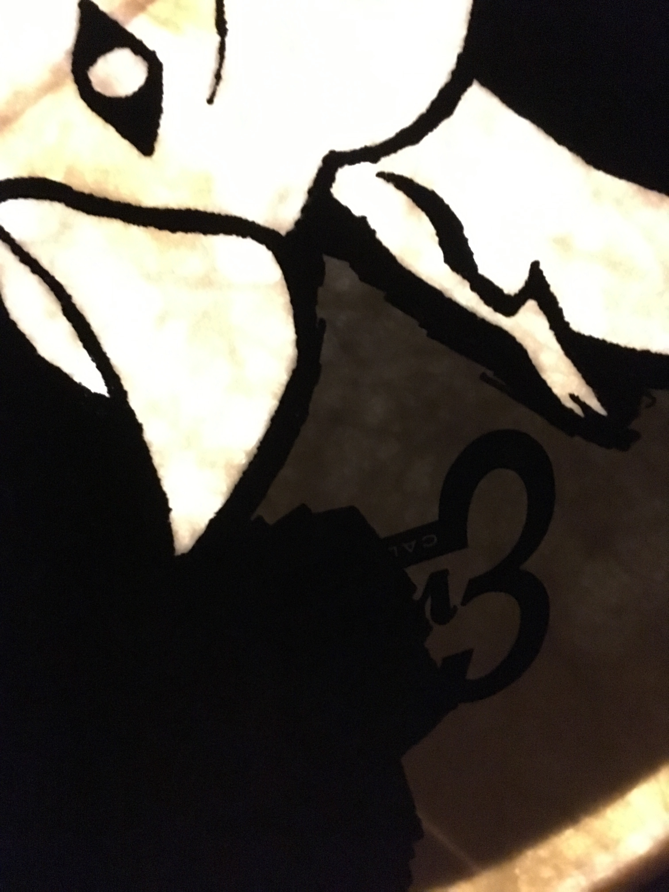

A fairly common occurence in established bands is to have a bass drum head with
the logo, band name, etcetera on it. Together with a couple of friends I have a
band where we play klezmer music (the band is called Klezmerkalaset, more about
it can be seen [here](https://facebook.com/klezmerkalaset),
[here](https://instagram.com/klezmerkalaset), and
[here](https://soundcloud.com/klezmerkalaset)), and we started talking about
buying a head like that. I like to understand how things are made and like to
create things, so I figured that it would be more fun to try to do one myself.
And, with a little help of a friend, I did! 

_Another background fact that's good to know is that I had already built a light_
_system into the bass drum, that flashes when the drum is being played (with_
_some additional modes). This can be seen ~~here~~_ (soon, hopefully!)_._
_With that in mind, I wanted to utilise and enhance that lighting effect._

## First steps

First things first. To put an image onto a drum head, I first needed to _have_
an image. A friend and former band member, Gunnar Weibull, is a very talented
drawing artist. He has made several really nice drawings for and of the band
before this, e. g. **this**:

I especially liked this one. The energy in the basilisk thrashing around is
very nice. When my friend drew this picture he said that:

> "This is how it feels to play klezmer music."

### On the treatise of basilisks

For those of you that don't know, a basilisk is a mythical creature. Many
people know the name from the Harry Potter series, but the OG basilisks were
said to be able to do things like strike people dead with a look, being so
venomous that it leaves a path of venom behind, split stones with
its breath. It looks like a combination of a snake and a rooster. Another name
for it is the 'king of serpents'. There are only a few methods of actually
killing a basilisk; most noteworthy is a rooster crowing (it was said that
people travelling through basilisk-infected lands would carry a rooster with
them for this purpose) or the "effluvium" of a weasel. In other words, the
stench of weasel piss. Apparently this is so horrible to basilisks that they
straight up die.

_More reading [here](https://wikipedia.org/en/basilisk)._

### Backing out of the mythology hole

My wish was to have a basilisk in the style of the image above, and also
utilise the effect from the lighting system already in the drum.  The general
idea to achieve this was to have a basilisk drawn, but on the drum head fill in
everything _but_ the basilisk, so that when the lights flash the light would be
in the form of a basilisk. A side-effect I hoped for was that in a low-light
venue this would result in basilisks being imprinted on the eyes of the
audience.

After some brainstorming and a few iterations, this was the result:

_Veeery_ nice.

## From digital to physical

So, how to get this image into the physical domain? If one would buy a drum
head professionally made, the image would probably be printed on the head.
Needless to say, not feasible for me. There are other techniques, for example
[hydrodipping](https://youtu.be/NI5CgKUiEi8?t=230). I'd love to try
hydrodipping, but then I would need a lot of extra things and the process seems
a bit messy. Living in an apartment (and being a student) I took the easier,
cheaper way out.

I scaled up the image (in Photoshop if I remember correctly), and used
centimeter units, matching the diameter of the black circle to the diameter of
the physical drum head. I split the image so that each split part fit and could
be printed on a single A4 paper. This made the printing step very easy, I could
use a regular printer. When printed, I cut out the circular shape, aligned the
sheets and taped them together:

I then taped the reconstructed image onto the backside of the drum head.
Speaking of which:

## The drum and its head

For reference, this was what the bass drum (and band) looked like before:

The bass drum head in that picture was included with the drum kit, and had two
negative qualities: it wasn't of a high quality, which made it sound.. not very
good, and maybe more relevant for this project, it was a glossy sort of plastic
making it hard to attach or draw permanently on it.  To mitigate both of these
issues, I bought another head, which had better quality and tried to mimic a
calf skin head (the type used on Western drums pre plastic), giving it a
slightly rugged texture. A close-up of it:

## Transferring image to head

The last part of the method. I decided to use black permanent markers. I bought
one with a fairly thin tip, to do details and edges, and a thicker, in the
shape of a squashed rectangle, to do large areas where no finer detail was
needed. To see where to draw, I taped the reconstructed paper image onto the
backside of the head, and put a light underneath. This way I could see the
image from the front part of the head, but still be able to draw (fill in). If
I had e. g. used a projector as a drawing reference, I would:

1. have been in the way of the projected image
2. have had issues with alignment: if I moved the projector or drum
   (accidentally or no) I would have to re-do the aligning
3. have to acquire a projector..

The set-up looked like this:

One issue was the Evans logo, which I didn't want to be visible in the finished
product (or in the way of the basilisk). What I did for that was to rotate the
head on the drum so that that logo would be in an entirely black area.

## Drawing!

So it finally comes to the drawing part! Here is a work-in-progress picture,
with most of the basilisk contours outlined:

All the basilisk contours drawn:

Trying to cover the Evans logo:

Looks better without camera flash..:

I had to draw (kind of) freehand, which is not my most practiced skill. But,
many small imperfections could be forgiven considering that most people will
see the head from a distance and in most cases fairly poor lighting. Add to
that the head being lit up from behind by the lighting system, and the anxiety
level for mistakes was lowered considerably.

Some action footage from the drawing phase:



Aaaand: the finished product!

The Evans logo that I wanted to hide is visible from up close, but as I wrote
above the majority of people will never see the head from such a short
distance.

Another view, with more of the drum as well:

And the head, backlit by the working lamp:

## Epilogue

The band with the finished head:

And in use:



Thank you for reading! /raz

---
